# 🏗️ Системная архитектура "Without Words Stroke"

## Обзор архитектуры

Платформа "Without Words Stroke" (WWS) построена по принципу **микросервисной архитектуры** с четким разделением ответственности между сервисами.

## Диаграмма архитектуры

```mermaid
graph TB
    subgraph "Клиентские приложения"
        MA[Мобильное приложение<br/>React Native]
        WA[Web приложение<br/>React/Next.js]
    end
    
    subgraph "API Gateway"
        AG[API Gateway<br/>Kong/Nginx]
        LB[Load Balancer<br/>HAProxy]
    end
    
    subgraph "Микросервисы"
        AS[Auth Service<br/>Аутентификация]
        HS[Health Service<br/>Медицинские данные]
        WS[Wearables Service<br/>Носимые устройства]
        ES[Emergency Service<br/>SOS функции]
        CS[Community Service<br/>Сообщество/Истории]
        MS[Marketplace Service<br/>Маркетплейс]
        AIS[AI Service<br/>ИИ ассистент]
        EDS[Education Service<br/>Обучение/Вебинары]
        CTS[Content Service<br/>Контент/Руководства]
        MKS[Marketing Service<br/>Кампании]
        RS[Registry Service<br/>Реестр клиник]
        PS[Partnership Service<br/>Партнерства]
        RDS[Research Service<br/>Исследования]
        NS[Neuro Service<br/>Нейротехнологии]
        CLS[Clinical Service<br/>Клинические испытания]
    end
    
    subgraph "Базы данных"
        PG[(PostgreSQL<br/>Основные данные)]
        RD[(Redis<br/>Кэш/Сессии)]
        MG[(MongoDB<br/>Логи/Аналитика)]
        TS[(Time-series DB<br/>InfluxDB)]
    end
    
    subgraph "Внешние сервисы"
        FH[Firebase<br/>Push уведомления]
        TW[Twilio<br/>SMS/Email]
        HF[Health APIs<br/>Apple Health/Google Fit]
        AI[OpenAI API<br/>AI ассистент]
        ZOOM[Zoom API<br/>Вебинары]
        YT[YouTube API<br/>Видео контент]
    end
    
    subgraph "Инфраструктура"
        K8S[Kubernetes<br/>Оркестрация]
        MON[Monitoring<br/>Prometheus/Grafana]
        LOG[Logging<br/>ELK Stack]
    end
    
    MA --> AG
    WA --> AG
    AG --> LB
    LB --> AS
    LB --> HS
    LB --> WS
    LB --> ES
    LB --> CS
    LB --> MS
    LB --> AIS
    LB --> EDS
    LB --> CTS
    LB --> MKS
    LB --> RS
    LB --> PS
    LB --> RDS
    LB --> NS
    LB --> CLS
    
    AS --> PG
    HS --> PG
    WS --> TS
    ES --> PG
    CS --> PG
    MS --> PG
    AIS --> PG
    EDS --> PG
    CTS --> PG
    MKS --> PG
    RS --> PG
    PS --> PG
    RDS --> PG
    NS --> TS
    CLS --> PG
    
    AS --> RD
    HS --> RD
    WS --> RD
    ES --> RD
    CS --> RD
    MS --> RD
    AIS --> RD
    EDS --> RD
    CTS --> RD
    MKS --> RD
    RS --> RD
    PS --> RD
    RDS --> RD
    NS --> RD
    CLS --> RD
    
    HS --> MG
    WS --> MG
    CS --> MG
    MS --> MG
    AIS --> MG
    EDS --> MG
    CTS --> MG
    MKS --> MG
    RS --> MG
    PS --> MG
    RDS --> MG
    NS --> MG
    CLS --> MG
    
    AS --> FH
    ES --> TW
    WS --> HF
    AIS --> AI
    EDS --> ZOOM
    EDS --> YT
    CTS --> YT
    
    AS --> K8S
    HS --> K8S
    WS --> K8S
    ES --> K8S
    CS --> K8S
    MS --> K8S
    AIS --> K8S
    EDS --> K8S
    CTS --> K8S
    MKS --> K8S
    RS --> K8S
    PS --> K8S
    RDS --> K8S
    NS --> K8S
    CLS --> K8S
    
    K8S --> MON
    K8S --> LOG
```

## Микросервисы

### Auth Service
- **Функции**: Аутентификация, авторизация, управление пользователями
- **Технологии**: JWT, OAuth 2.0, 2FA
- **База данных**: PostgreSQL (users, roles, permissions)
- **Особенности**: Ролевая модель (RBAC), управление разрешениями, контекстная авторизация

### Health Service
- **Функции**: Медицинские данные, дневник состояния, аналитика
- **Технологии**: Node.js, PostgreSQL
- **База данных**: PostgreSQL (medical_records, health_metrics, symptoms)
- **Особенности**: HIPAA compliance, шифрование данных

### Wearables Service
- **Функции**: Интеграция с носимыми устройствами, синхронизация данных
- **Технологии**: Node.js, WebSocket, BLE
- **База данных**: InfluxDB (wearables_data, health_metrics)
- **Особенности**: Real-time синхронизация, множественные протоколы

### Emergency Service
- **Функции**: SOS кнопка, экстренные контакты, уведомления
- **Технологии**: Node.js, WebSocket, Twilio
- **База данных**: PostgreSQL (emergency_contacts, sos_events)
- **Особенности**: Real-time уведомления, геолокация

### Community Service
- **Функции**: Форум, чаты, группы поддержки, истории выживших
- **Технологии**: Node.js, WebSocket, PostgreSQL
- **База данных**: PostgreSQL (posts, comments, groups, survivor_stories)
- **Особенности**: Модерация контента, эмоциональная поддержка, истории успеха

### Marketplace Service
- **Функции**: Товары и услуги, заказы, платежи
- **Технологии**: Node.js, PostgreSQL, Stripe
- **База данных**: PostgreSQL (products, orders, payments, reviews)
- **Особенности**: Многоязычность, локализация цен

### AI Service
- **Функции**: Чат-ассистент, рекомендации, предиктивная аналитика
- **Технологии**: Python, OpenAI API, TensorFlow
- **База данных**: PostgreSQL (ai_conversations, recommendations)
- **Особенности**: ML модели, персонализация

### Education Service
- **Функции**: Вебинары, курсы, Stroke Academy, сертификаты
- **Технологии**: Node.js, PostgreSQL, Zoom API, YouTube API
- **База данных**: PostgreSQL (courses, webinars, enrollments, progress, certificates)
- **Особенности**: Планирование, записи, прогресс обучения

### Content Service
- **Функции**: Руководства, лучшие практики, образовательный контент
- **Технологии**: Node.js, PostgreSQL, CDN
- **База данных**: PostgreSQL (guidelines, best_practices, educational_content)
- **Особенности**: Многоязычность, версионность, адаптация по странам

### Marketing Service
- **Функции**: Кампании осведомленности, маркетинговые материалы
- **Технологии**: Node.js, PostgreSQL, Social Media APIs
- **База данных**: PostgreSQL (campaigns, campaign_content, analytics)
- **Особенности**: Управление кампаниями, трекинг, социальные сети

### Registry Service
- **Функции**: Реестр клиник, бенчмаркинг, KPI сравнение
- **Технологии**: Node.js, PostgreSQL, Analytics
- **База данных**: PostgreSQL (hospitals, kpi_metrics, benchmarks, reports)
- **Особенности**: Сравнительная аналитика, отчеты, стандарты

### Partnership Service
- **Функции**: Управление партнерствами с НКО, соглашения
- **Технологии**: Node.js, PostgreSQL, Document Management
- **База данных**: PostgreSQL (partners, partnership_types, agreements)
- **Особенности**: Документооборот, статусы, уведомления

### Research Service
- **Функции**: Сбор данных для исследований, анонимизация
- **Технологии**: Python, PostgreSQL, Apache Kafka
- **База данных**: PostgreSQL (research_data, anonymized_metrics)
- **Особенности**: GDPR compliance, этические стандарты

### Neuro Service
- **Функции**: Интеграция с нейроинтерфейсами, обработка нейроданных
- **Технологии**: Python, WebSocket, MQTT
- **База данных**: InfluxDB (neuro_data, brain_signals)
- **Особенности**: Real-time обработка, высокая производительность

### Clinical Service
- **Функции**: Платформа для клинических испытаний, управление участниками
- **Технологии**: Node.js, PostgreSQL, React
- **База данных**: PostgreSQL (trials, participants, results)
- **Особенности**: Регуляторное соответствие, аудит

## Базы данных

### PostgreSQL (Основная база данных)
- **Назначение**: Основные данные приложения
- **Таблицы**: 
  - `users`, `roles`, `permissions` (аутентификация)
  - `medical_records`, `rehabilitation_plans`, `appointments` (медицина)
  - `support_requests`, `volunteer_assignments` (социальная поддержка)
  - `products`, `services`, `orders`, `reviews` (маркетплейс)
  - `posts`, `comments`, `survivor_stories` (сообщество)
  - `courses`, `webinars`, `enrollments` (образование)
  - `guidelines`, `best_practices` (контент)
  - `campaigns`, `campaign_content` (маркетинг)
  - `hospitals`, `kpi_metrics`, `benchmarks` (реестр)
  - `partners`, `partnership_types` (партнерства)
- **Особенности**: ACID транзакции, ролевая модель, многоязычность

### Redis (Кэш и сессии)
- **Назначение**: Кэширование, сессии, временные данные
- **Использование**: 
  - Кэш API ответов
  - Сессии пользователей
  - Временные токены
  - Очереди задач
- **Особенности**: Высокая производительность, TTL

### MongoDB (Логи и аналитика)
- **Назначение**: Логирование, аналитика, неструктурированные данные
- **Коллекции**:
  - `user_activity_logs`
  - `system_logs`
  - `analytics_events`
  - `error_logs`
- **Особенности**: Гибкая схема, агрегация данных

### InfluxDB (Временные ряды)
- **Назначение**: Метрики носимых устройств, нейротехнологии
- **Измерения**:
  - `heart_rate`, `steps`, `sleep`
  - `brain_signals`, `neural_activity`
  - `system_metrics`
- **Особенности**: Оптимизация для временных рядов, высокая производительность

## Внешние интеграции

### Health APIs
- **Apple HealthKit** - iOS устройства
- **Google Health Connect** - Android устройства
- **Fitbit API** - фитнес трекеры
- **Garmin Health API** - спортивные устройства
- **Samsung Health SDK** - Samsung устройства
- **Huawei Health API** - Huawei устройства
- **Xiaomi Mi Band** - бюджетные трекеры

### Communication APIs
- **Firebase** - Push уведомления
- **Twilio** - SMS, Email, Voice
- **Zoom API** - вебинары и видеоконференции
- **YouTube API** - видео контент

### AI/ML Services
- **OpenAI API** - чат-ассистент, генерация контента
- **TensorFlow** - ML модели
- **Custom ML** - предиктивная аналитика

### Social Media APIs
- **Facebook API** - социальные кампании
- **Twitter API** - микроблогинг
- **LinkedIn API** - профессиональные сети
- **Instagram API** - визуальный контент

## Безопасность

### Аутентификация и авторизация
- **JWT токены** - безопасная аутентификация
- **OAuth 2.0** - интеграция с внешними сервисами
- **2FA** - двухфакторная аутентификация
- **RBAC** - ролевая модель доступа

### Шифрование данных
- **TLS 1.3** - шифрование в передаче
- **AES-256** - шифрование в покое
- **HTTPS** - безопасная передача
- **VPN** - защищенные соединения

### Соответствие стандартам
- **GDPR** - защита персональных данных
- **HIPAA** - медицинские данные
- **ISO 27001** - информационная безопасность
- **SOC 2** - аудит безопасности

## Масштабирование

### Горизонтальное масштабирование
- **Kubernetes** - оркестрация контейнеров
- **Load Balancer** - распределение нагрузки
- **Auto Scaling** - автоматическое масштабирование
- **Multi-region** - географическое распределение

### Вертикальное масштабирование
- **Resource Limits** - ограничения ресурсов
- **Performance Monitoring** - мониторинг производительности
- **Database Optimization** - оптимизация БД
- **Caching Strategy** - стратегия кэширования

## Мониторинг и логирование

### Мониторинг
- **Prometheus** - сбор метрик
- **Grafana** - визуализация данных
- **AlertManager** - управление алертами
- **Uptime Monitoring** - мониторинг доступности

### Логирование
- **ELK Stack** - Elasticsearch, Logstash, Kibana
- **Structured Logging** - структурированные логи
- **Log Aggregation** - агрегация логов
- **Error Tracking** - отслеживание ошибок

## Развертывание

### Контейнеризация
- **Docker** - контейнеризация приложений
- **Docker Compose** - локальная разработка
- **Multi-stage builds** - оптимизация образов
- **Security scanning** - сканирование безопасности

### CI/CD
- **GitHub Actions** - автоматизация сборки
- **GitLab CI** - альтернативная платформа
- **Automated Testing** - автоматическое тестирование
- **Blue-Green Deployment** - безопасное развертывание

### Инфраструктура
- **Kubernetes** - оркестрация
- **Helm Charts** - управление релизами
- **Ingress Controller** - маршрутизация трафика
- **Service Mesh** - управление сервисами

---

*Системная архитектура "Without Words Stroke" - последнее обновление: 14.09.2025*