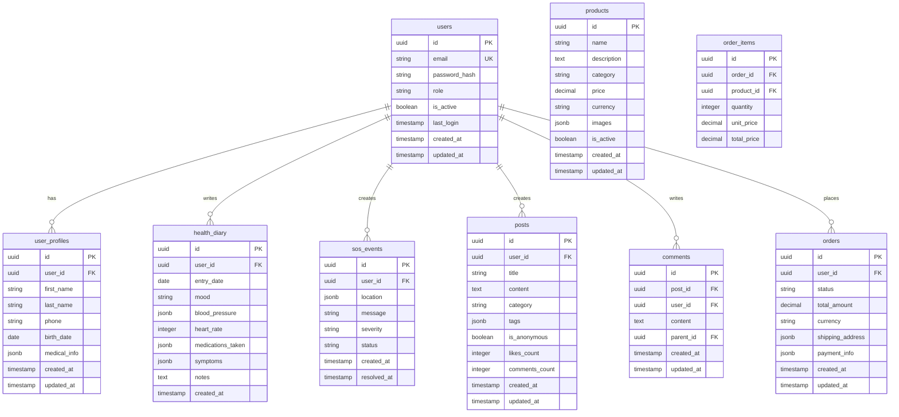

# 🗄️ PostgreSQL Схема базы данных

## Обзор

База данных построена на PostgreSQL 14+ с использованием реляционной модели данных. Схема оптимизирована для высокой производительности и масштабируемости.

## Диаграмма ER



## Таблицы

### 1. users
Основная таблица пользователей системы.

```sql
CREATE TABLE users (
    id UUID PRIMARY KEY DEFAULT gen_random_uuid(),
    email VARCHAR(255) UNIQUE NOT NULL,
    password_hash VARCHAR(255) NOT NULL,
    role VARCHAR(50) NOT NULL CHECK (role IN ('patient', 'relative', 'doctor', 'admin')),
    is_active BOOLEAN DEFAULT true,
    last_login TIMESTAMP,
    created_at TIMESTAMP DEFAULT CURRENT_TIMESTAMP,
    updated_at TIMESTAMP DEFAULT CURRENT_TIMESTAMP
);

-- Индексы
CREATE INDEX idx_users_email ON users(email);
CREATE INDEX idx_users_role ON users(role);
CREATE INDEX idx_users_active ON users(is_active);
```

### 2. user_profiles
Расширенная информация о пользователях.

```sql
CREATE TABLE user_profiles (
    id UUID PRIMARY KEY DEFAULT gen_random_uuid(),
    user_id UUID NOT NULL REFERENCES users(id) ON DELETE CASCADE,
    first_name VARCHAR(100),
    last_name VARCHAR(100),
    phone VARCHAR(20),
    birth_date DATE,
    medical_info JSONB,
    avatar_url VARCHAR(500),
    created_at TIMESTAMP DEFAULT CURRENT_TIMESTAMP,
    updated_at TIMESTAMP DEFAULT CURRENT_TIMESTAMP
);

-- Индексы
CREATE INDEX idx_user_profiles_user_id ON user_profiles(user_id);
CREATE INDEX idx_user_profiles_phone ON user_profiles(phone);
CREATE INDEX idx_user_profiles_medical_info ON user_profiles USING GIN(medical_info);
```

### 3. health_diary
Дневник здоровья пользователей.

```sql
CREATE TABLE health_diary (
    id UUID PRIMARY KEY DEFAULT gen_random_uuid(),
    user_id UUID NOT NULL REFERENCES users(id) ON DELETE CASCADE,
    entry_date DATE NOT NULL,
    mood VARCHAR(20) CHECK (mood IN ('excellent', 'good', 'fair', 'poor', 'terrible')),
    blood_pressure JSONB, -- {"systolic": 120, "diastolic": 80}
    heart_rate INTEGER CHECK (heart_rate > 0 AND heart_rate < 300),
    medications_taken JSONB, -- ["Аспирин", "Аторвастатин"]
    symptoms JSONB, -- ["головная боль", "тошнота"]
    notes TEXT,
    created_at TIMESTAMP DEFAULT CURRENT_TIMESTAMP
);

-- Индексы
CREATE INDEX idx_health_diary_user_id ON health_diary(user_id);
CREATE INDEX idx_health_diary_date ON health_diary(entry_date);
CREATE INDEX idx_health_diary_user_date ON health_diary(user_id, entry_date);
```

### 4. sos_events
События экстренной помощи.

```sql
CREATE TABLE sos_events (
    id UUID PRIMARY KEY DEFAULT gen_random_uuid(),
    user_id UUID NOT NULL REFERENCES users(id) ON DELETE CASCADE,
    location JSONB NOT NULL, -- {"latitude": 55.7558, "longitude": 37.6176, "address": "..."}
    message TEXT,
    severity VARCHAR(20) DEFAULT 'medium' CHECK (severity IN ('low', 'medium', 'high', 'critical')),
    status VARCHAR(20) DEFAULT 'pending' CHECK (status IN ('pending', 'processing', 'resolved', 'cancelled')),
    resolved_at TIMESTAMP,
    created_at TIMESTAMP DEFAULT CURRENT_TIMESTAMP
);

-- Индексы
CREATE INDEX idx_sos_events_user_id ON sos_events(user_id);
CREATE INDEX idx_sos_events_status ON sos_events(status);
CREATE INDEX idx_sos_events_created_at ON sos_events(created_at);
CREATE INDEX idx_sos_events_location ON sos_events USING GIN(location);
```

### 5. emergency_contacts
Контакты для экстренных случаев.

```sql
CREATE TABLE emergency_contacts (
    id UUID PRIMARY KEY DEFAULT gen_random_uuid(),
    user_id UUID NOT NULL REFERENCES users(id) ON DELETE CASCADE,
    name VARCHAR(100) NOT NULL,
    phone VARCHAR(20) NOT NULL,
    relationship VARCHAR(50),
    is_primary BOOLEAN DEFAULT false,
    created_at TIMESTAMP DEFAULT CURRENT_TIMESTAMP
);

-- Индексы
CREATE INDEX idx_emergency_contacts_user_id ON emergency_contacts(user_id);
CREATE INDEX idx_emergency_contacts_primary ON emergency_contacts(user_id, is_primary);
```

### 6. posts
Посты в сообществе.

```sql
CREATE TABLE posts (
    id UUID PRIMARY KEY DEFAULT gen_random_uuid(),
    user_id UUID NOT NULL REFERENCES users(id) ON DELETE CASCADE,
    title VARCHAR(200) NOT NULL,
    content TEXT NOT NULL,
    category VARCHAR(50) NOT NULL CHECK (category IN ('rehabilitation', 'support', 'stories', 'questions', 'tips')),
    tags JSONB, -- ["упражнения", "прогресс"]
    is_anonymous BOOLEAN DEFAULT false,
    likes_count INTEGER DEFAULT 0,
    comments_count INTEGER DEFAULT 0,
    views_count INTEGER DEFAULT 0,
    is_published BOOLEAN DEFAULT true,
    created_at TIMESTAMP DEFAULT CURRENT_TIMESTAMP,
    updated_at TIMESTAMP DEFAULT CURRENT_TIMESTAMP
);

-- Индексы
CREATE INDEX idx_posts_user_id ON posts(user_id);
CREATE INDEX idx_posts_category ON posts(category);
CREATE INDEX idx_posts_published ON posts(is_published);
CREATE INDEX idx_posts_created_at ON posts(created_at DESC);
CREATE INDEX idx_posts_tags ON posts USING GIN(tags);
```

### 7. comments
Комментарии к постам.

```sql
CREATE TABLE comments (
    id UUID PRIMARY KEY DEFAULT gen_random_uuid(),
    post_id UUID NOT NULL REFERENCES posts(id) ON DELETE CASCADE,
    user_id UUID NOT NULL REFERENCES users(id) ON DELETE CASCADE,
    content TEXT NOT NULL,
    parent_id UUID REFERENCES comments(id) ON DELETE CASCADE, -- для ответов на комментарии
    likes_count INTEGER DEFAULT 0,
    created_at TIMESTAMP DEFAULT CURRENT_TIMESTAMP,
    updated_at TIMESTAMP DEFAULT CURRENT_TIMESTAMP
);

-- Индексы
CREATE INDEX idx_comments_post_id ON comments(post_id);
CREATE INDEX idx_comments_user_id ON comments(user_id);
CREATE INDEX idx_comments_parent_id ON comments(parent_id);
CREATE INDEX idx_comments_created_at ON comments(created_at DESC);
```

### 8. post_likes
Лайки постов.

```sql
CREATE TABLE post_likes (
    id UUID PRIMARY KEY DEFAULT gen_random_uuid(),
    post_id UUID NOT NULL REFERENCES posts(id) ON DELETE CASCADE,
    user_id UUID NOT NULL REFERENCES users(id) ON DELETE CASCADE,
    created_at TIMESTAMP DEFAULT CURRENT_TIMESTAMP,
    UNIQUE(post_id, user_id)
);

-- Индексы
CREATE INDEX idx_post_likes_post_id ON post_likes(post_id);
CREATE INDEX idx_post_likes_user_id ON post_likes(user_id);
```

### 9. products
Товары в маркетплейсе.

```sql
CREATE TABLE products (
    id UUID PRIMARY KEY DEFAULT gen_random_uuid(),
    name VARCHAR(200) NOT NULL,
    description TEXT,
    category VARCHAR(50) NOT NULL CHECK (category IN ('medical_equipment', 'medications', 'books', 'accessories')),
    price DECIMAL(10,2) NOT NULL,
    currency VARCHAR(3) DEFAULT 'RUB',
    images JSONB, -- ["url1", "url2"]
    stock_quantity INTEGER DEFAULT 0,
    is_active BOOLEAN DEFAULT true,
    vendor_id UUID,
    created_at TIMESTAMP DEFAULT CURRENT_TIMESTAMP,
    updated_at TIMESTAMP DEFAULT CURRENT_TIMESTAMP
);

-- Индексы
CREATE INDEX idx_products_category ON products(category);
CREATE INDEX idx_products_active ON products(is_active);
CREATE INDEX idx_products_price ON products(price);
CREATE INDEX idx_products_vendor ON products(vendor_id);
```

### 10. orders
Заказы пользователей.

```sql
CREATE TABLE orders (
    id UUID PRIMARY KEY DEFAULT gen_random_uuid(),
    user_id UUID NOT NULL REFERENCES users(id) ON DELETE CASCADE,
    order_number VARCHAR(50) UNIQUE NOT NULL,
    status VARCHAR(20) DEFAULT 'pending' CHECK (status IN ('pending', 'confirmed', 'shipped', 'delivered', 'cancelled')),
    total_amount DECIMAL(10,2) NOT NULL,
    currency VARCHAR(3) DEFAULT 'RUB',
    shipping_address JSONB NOT NULL,
    payment_info JSONB,
    notes TEXT,
    created_at TIMESTAMP DEFAULT CURRENT_TIMESTAMP,
    updated_at TIMESTAMP DEFAULT CURRENT_TIMESTAMP
);

-- Индексы
CREATE INDEX idx_orders_user_id ON orders(user_id);
CREATE INDEX idx_orders_status ON orders(status);
CREATE INDEX idx_orders_created_at ON orders(created_at DESC);
CREATE INDEX idx_orders_number ON orders(order_number);
```

### 11. order_items
Элементы заказов.

```sql
CREATE TABLE order_items (
    id UUID PRIMARY KEY DEFAULT gen_random_uuid(),
    order_id UUID NOT NULL REFERENCES orders(id) ON DELETE CASCADE,
    product_id UUID NOT NULL REFERENCES products(id),
    quantity INTEGER NOT NULL CHECK (quantity > 0),
    unit_price DECIMAL(10,2) NOT NULL,
    total_price DECIMAL(10,2) NOT NULL
);

-- Индексы
CREATE INDEX idx_order_items_order_id ON order_items(order_id);
CREATE INDEX idx_order_items_product_id ON order_items(product_id);
```

### 12. notifications
Уведомления пользователей.

```sql
CREATE TABLE notifications (
    id UUID PRIMARY KEY DEFAULT gen_random_uuid(),
    user_id UUID NOT NULL REFERENCES users(id) ON DELETE CASCADE,
    type VARCHAR(50) NOT NULL CHECK (type IN ('emergency', 'health_reminder', 'community', 'marketplace', 'system')),
    title VARCHAR(200) NOT NULL,
    message TEXT NOT NULL,
    data JSONB, -- дополнительные данные
    is_read BOOLEAN DEFAULT false,
    created_at TIMESTAMP DEFAULT CURRENT_TIMESTAMP
);

-- Индексы
CREATE INDEX idx_notifications_user_id ON notifications(user_id);
CREATE INDEX idx_notifications_type ON notifications(type);
CREATE INDEX idx_notifications_read ON notifications(is_read);
CREATE INDEX idx_notifications_created_at ON notifications(created_at DESC);
```

## Функции и триггеры

### Обновление updated_at
```sql
CREATE OR REPLACE FUNCTION update_updated_at_column()
RETURNS TRIGGER AS $$
BEGIN
    NEW.updated_at = CURRENT_TIMESTAMP;
    RETURN NEW;
END;
$$ language 'plpgsql';

-- Применение к таблицам
CREATE TRIGGER update_users_updated_at BEFORE UPDATE ON users
    FOR EACH ROW EXECUTE FUNCTION update_updated_at_column();

CREATE TRIGGER update_user_profiles_updated_at BEFORE UPDATE ON user_profiles
    FOR EACH ROW EXECUTE FUNCTION update_updated_at_column();

CREATE TRIGGER update_posts_updated_at BEFORE UPDATE ON posts
    FOR EACH ROW EXECUTE FUNCTION update_updated_at_column();
```

### Обновление счетчиков лайков
```sql
CREATE OR REPLACE FUNCTION update_post_likes_count()
RETURNS TRIGGER AS $$
BEGIN
    IF TG_OP = 'INSERT' THEN
        UPDATE posts SET likes_count = likes_count + 1 WHERE id = NEW.post_id;
        RETURN NEW;
    ELSIF TG_OP = 'DELETE' THEN
        UPDATE posts SET likes_count = likes_count - 1 WHERE id = OLD.post_id;
        RETURN OLD;
    END IF;
    RETURN NULL;
END;
$$ language 'plpgsql';

CREATE TRIGGER update_post_likes_count_trigger
    AFTER INSERT OR DELETE ON post_likes
    FOR EACH ROW EXECUTE FUNCTION update_post_likes_count();
```

### Обновление счетчиков комментариев
```sql
CREATE OR REPLACE FUNCTION update_post_comments_count()
RETURNS TRIGGER AS $$
BEGIN
    IF TG_OP = 'INSERT' THEN
        UPDATE posts SET comments_count = comments_count + 1 WHERE id = NEW.post_id;
        RETURN NEW;
    ELSIF TG_OP = 'DELETE' THEN
        UPDATE posts SET comments_count = comments_count - 1 WHERE id = OLD.post_id;
        RETURN OLD;
    END IF;
    RETURN NULL;
END;
$$ language 'plpgsql';

CREATE TRIGGER update_post_comments_count_trigger
    AFTER INSERT OR DELETE ON comments
    FOR EACH ROW EXECUTE FUNCTION update_post_comments_count();
```

## Представления (Views)

### Статистика пользователей
```sql
CREATE VIEW user_statistics AS
SELECT 
    u.id,
    u.email,
    up.first_name,
    up.last_name,
    COUNT(DISTINCT hd.id) as diary_entries_count,
    COUNT(DISTINCT p.id) as posts_count,
    COUNT(DISTINCT c.id) as comments_count,
    COUNT(DISTINCT o.id) as orders_count,
    u.created_at as registration_date
FROM users u
LEFT JOIN user_profiles up ON u.id = up.user_id
LEFT JOIN health_diary hd ON u.id = hd.user_id
LEFT JOIN posts p ON u.id = p.user_id
LEFT JOIN comments c ON u.id = c.user_id
LEFT JOIN orders o ON u.id = o.user_id
GROUP BY u.id, u.email, up.first_name, up.last_name, u.created_at;
```

### Популярные посты
```sql
CREATE VIEW popular_posts AS
SELECT 
    p.id,
    p.title,
    p.category,
    p.likes_count,
    p.comments_count,
    p.views_count,
    p.created_at,
    up.first_name,
    up.last_name
FROM posts p
JOIN user_profiles up ON p.user_id = up.user_id
WHERE p.is_published = true
ORDER BY (p.likes_count + p.comments_count + p.views_count) DESC;
```

## Индексы для производительности

### Составные индексы
```sql
-- Для поиска постов по категории и дате
CREATE INDEX idx_posts_category_created_at ON posts(category, created_at DESC);

-- Для поиска записей дневника по пользователю и дате
CREATE INDEX idx_health_diary_user_date ON health_diary(user_id, entry_date DESC);

-- Для поиска SOS событий по пользователю и статусу
CREATE INDEX idx_sos_events_user_status ON sos_events(user_id, status);

-- Для поиска заказов по пользователю и статусу
CREATE INDEX idx_orders_user_status ON orders(user_id, status);
```

### GIN индексы для JSONB
```sql
-- Для поиска по медицинской информации
CREATE INDEX idx_user_profiles_medical_info_gin ON user_profiles USING GIN(medical_info);

-- Для поиска по тегам постов
CREATE INDEX idx_posts_tags_gin ON posts USING GIN(tags);

-- Для поиска по локации SOS событий
CREATE INDEX idx_sos_events_location_gin ON sos_events USING GIN(location);
```

## Настройки производительности

### Конфигурация PostgreSQL
```sql
-- Настройки для производительности
ALTER SYSTEM SET shared_buffers = '256MB';
ALTER SYSTEM SET effective_cache_size = '1GB';
ALTER SYSTEM SET maintenance_work_mem = '64MB';
ALTER SYSTEM SET checkpoint_completion_target = 0.9;
ALTER SYSTEM SET wal_buffers = '16MB';
ALTER SYSTEM SET default_statistics_target = 100;
```

---
*Последнее обновление: 14.09.2025*
