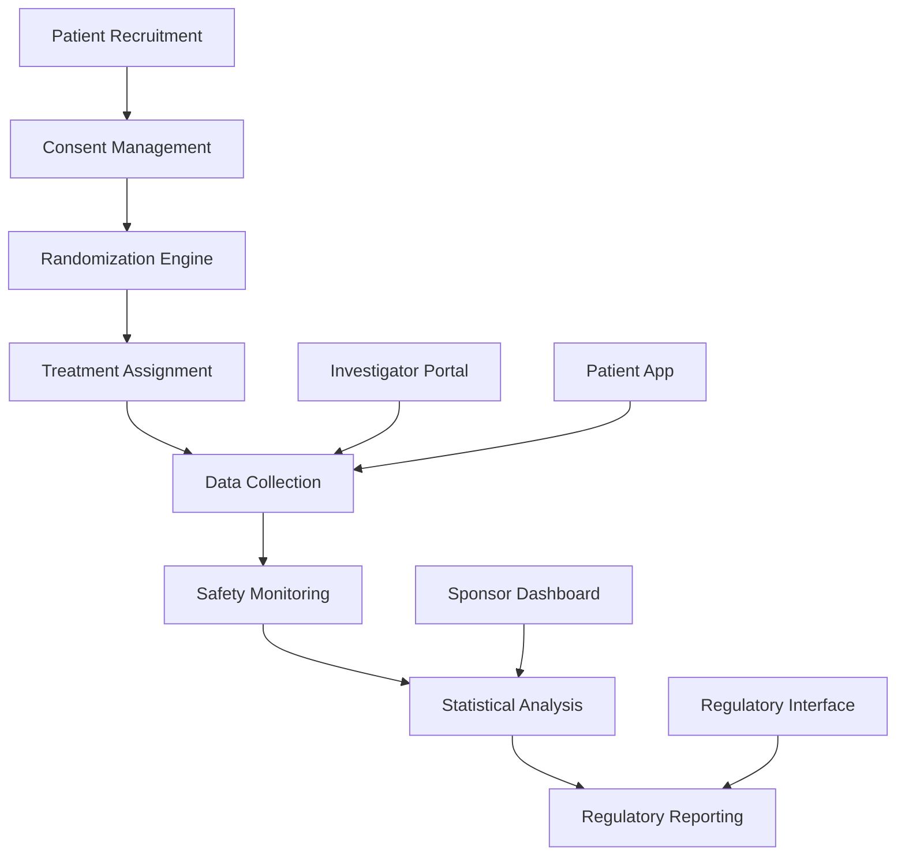

# 🧪 Платформа для клинических испытаний

## Обзор

Комплексная платформа для проведения клинических испытаний нейротехнологий и методов реабилитации после инсульта, интегрированная с основной экосистемой платформы.

## Архитектура платформы

### 1. Компоненты системы


### 2. Микросервисная архитектура
```typescript
// Основные сервисы платформы
interface ClinicalTrialServices {
  // Управление исследованиями
  study_management: {
    study_design: StudyDesignService;
    protocol_management: ProtocolService;
    site_management: SiteService;
    investigator_management: InvestigatorService;
  };

  // Управление участниками
  participant_management: {
    recruitment: RecruitmentService;
    screening: ScreeningService;
    randomization: RandomizationService;
    consent: ConsentService;
  };

  // Сбор данных
  data_collection: {
    eCRF: eCRFService;
    ePRO: ePROService;
    eDiary: eDiaryService;
    device_integration: DeviceIntegrationService;
  };

  // Мониторинг и безопасность
  monitoring: {
    safety_monitoring: SafetyMonitoringService;
    data_quality: DataQualityService;
    risk_management: RiskManagementService;
    audit_trail: AuditTrailService;
  };

  // Анализ и отчетность
  analytics: {
    statistical_analysis: StatisticalAnalysisService;
    interim_analysis: InterimAnalysisService;
    final_analysis: FinalAnalysisService;
    regulatory_reporting: RegulatoryReportingService;
  };
}
```

## Управление исследованиями

### 1. Дизайн исследования
```typescript
@Entity('clinical_studies')
export class ClinicalStudy {
  @PrimaryGeneratedColumn('uuid')
  id: string;

  @Column()
  study_title: string;

  @Column()
  study_phase: 'Phase I' | 'Phase II' | 'Phase III' | 'Phase IV';

  @Column()
  study_type: 'Interventional' | 'Observational' | 'Expanded Access';

  @Column('jsonb')
  study_design: {
    randomization: 'Randomized' | 'Non-randomized';
    masking: 'Open Label' | 'Single Blind' | 'Double Blind' | 'Triple Blind';
    allocation: 'Parallel' | 'Crossover' | 'Factorial' | 'Sequential';
    endpoint_classification: 'Safety/Efficacy' | 'Safety' | 'Efficacy';
    intervention_model: string;
  };

  @Column('jsonb')
  eligibility_criteria: {
    inclusion_criteria: string[];
    exclusion_criteria: string[];
    age_min: number;
    age_max: number;
    gender: 'All' | 'Male' | 'Female';
    health_status: string[];
  };

  @Column('jsonb')
  primary_endpoints: {
    endpoint_name: string;
    endpoint_type: 'Primary' | 'Secondary' | 'Exploratory';
    measurement_method: string;
    time_frame: string;
  }[];

  @Column('jsonb')
  secondary_endpoints: {
    endpoint_name: string;
    endpoint_type: 'Primary' | 'Secondary' | 'Exploratory';
    measurement_method: string;
    time_frame: string;
  }[];

  @Column('int')
  target_enrollment: number;

  @Column('date')
  study_start_date: Date;

  @Column('date')
  study_end_date: Date;

  @Column()
  status: 'Draft' | 'Submitted' | 'Approved' | 'Active' | 'Completed' | 'Terminated';

  @CreateDateColumn()
  created_at: Date;

  @UpdateDateColumn()
  updated_at: Date;
}
```

### 2. Протокол исследования
```typescript
export class ProtocolService {
  async createProtocol(studyId: string, protocolData: ProtocolData): Promise<Protocol> {
    const protocol = this.protocolRepository.create({
      study_id: studyId,
      ...protocolData,
    });

    return this.protocolRepository.save(protocol);
  }

  async updateProtocol(protocolId: string, updates: Partial<ProtocolData>): Promise<Protocol> {
    await this.protocolRepository.update(protocolId, updates);
    return this.protocolRepository.findOne({ where: { id: protocolId } });
  }

  async getProtocol(studyId: string): Promise<Protocol> {
    return this.protocolRepository.findOne({ where: { study_id: studyId } });
  }

  async validateProtocol(protocol: Protocol): Promise<ValidationResult> {
    const errors: string[] = [];

    // Валидация дизайна исследования
    if (!protocol.study_design.randomization) {
      errors.push('Randomization method is required');
    }

    // Валидация критериев включения/исключения
    if (protocol.eligibility_criteria.inclusion_criteria.length === 0) {
      errors.push('At least one inclusion criterion is required');
    }

    // Валидация первичных эндпоинтов
    if (protocol.primary_endpoints.length === 0) {
      errors.push('At least one primary endpoint is required');
    }

    return {
      is_valid: errors.length === 0,
      errors,
    };
  }
}
```

## Управление участниками

### 1. Система рекрутинга
```typescript
export class RecruitmentService {
  async findEligibleParticipants(studyId: string, criteria: EligibilityCriteria): Promise<Participant[]> {
    const study = await this.studyRepository.findById(studyId);
    const query = this.buildEligibilityQuery(criteria);

    // Поиск в базе данных платформы
    const platformUsers = await this.userRepository.find(query);

    // Фильтрация по дополнительным критериям
    const eligibleUsers = await this.applyAdditionalFilters(platformUsers, criteria);

    return eligibleUsers.map(user => this.mapToParticipant(user));
  }

  async sendRecruitmentInvitation(participantId: string, studyId: string): Promise<void> {
    const participant = await this.participantRepository.findById(participantId);
    const study = await this.studyRepository.findById(studyId);

    const invitation = {
      participant_id: participantId,
      study_id: studyId,
      invitation_text: this.generateInvitationText(study),
      invitation_date: new Date(),
      status: 'sent',
    };

    await this.invitationRepository.save(invitation);
    await this.notificationService.sendRecruitmentInvitation(participant, study);
  }

  private buildEligibilityQuery(criteria: EligibilityCriteria): any {
    const query: any = {};

    // Возрастные критерии
    if (criteria.age_min || criteria.age_max) {
      query.birth_date = {};
      if (criteria.age_min) {
        query.birth_date.$lte = this.calculateMaxBirthDate(criteria.age_min);
      }
      if (criteria.age_max) {
        query.birth_date.$gte = this.calculateMinBirthDate(criteria.age_max);
      }
    }

    // Пол
    if (criteria.gender && criteria.gender !== 'All') {
      query.gender = criteria.gender;
    }

    // Медицинские критерии
    if (criteria.health_status && criteria.health_status.length > 0) {
      query.medical_conditions = { $in: criteria.health_status };
    }

    return query;
  }
}
```

### 2. Система рандомизации
```typescript
export class RandomizationService {
  async randomizeParticipant(participantId: string, studyId: string): Promise<RandomizationResult> {
    const study = await this.studyRepository.findById(studyId);
    const randomizationScheme = await this.getRandomizationScheme(studyId);

    // Проверка стратификации
    const stratificationFactors = await this.calculateStratificationFactors(participantId, studyId);
    
    // Выполнение рандомизации
    const treatment = await this.performRandomization(randomizationScheme, stratificationFactors);

    // Сохранение результата
    const randomization = await this.randomizationRepository.save({
      participant_id: participantId,
      study_id: studyId,
      treatment_group: treatment.group,
      randomization_date: new Date(),
      stratification_factors: stratificationFactors,
    });

    return {
      participant_id: participantId,
      treatment_group: treatment.group,
      randomization_ratio: treatment.ratio,
      stratification_factors: stratificationFactors,
    };
  }

  private async performRandomization(scheme: RandomizationScheme, factors: StratificationFactors): Promise<TreatmentAssignment> {
    switch (scheme.type) {
      case 'Simple':
        return this.simpleRandomization(scheme);
      case 'Block':
        return this.blockRandomization(scheme, factors);
      case 'Stratified':
        return this.stratifiedRandomization(scheme, factors);
      case 'Adaptive':
        return this.adaptiveRandomization(scheme, factors);
      default:
        throw new Error(`Unsupported randomization type: ${scheme.type}`);
    }
  }
}
```

### 3. Управление согласием
```typescript
export class ConsentService {
  async createConsentForm(studyId: string, consentData: ConsentFormData): Promise<ConsentForm> {
    const consentForm = this.consentFormRepository.create({
      study_id: studyId,
      ...consentData,
    });

    return this.consentFormRepository.save(consentForm);
  }

  async obtainConsent(participantId: string, studyId: string, consentData: ConsentData): Promise<Consent> {
    // Валидация согласия
    const validation = await this.validateConsent(consentData);
    if (!validation.is_valid) {
      throw new BadRequestException('Invalid consent data');
    }

    // Создание записи о согласии
    const consent = await this.consentRepository.save({
      participant_id: participantId,
      study_id: studyId,
      consent_form_version: consentData.form_version,
      consent_date: new Date(),
      consent_method: consentData.method, // 'digital', 'paper', 'video'
      witness_present: consentData.witness_present,
      witness_name: consentData.witness_name,
      status: 'granted',
    });

    // Уведомление исследовательской команды
    await this.notifyInvestigatorTeam(studyId, participantId, consent);

    return consent;
  }

  async withdrawConsent(participantId: string, studyId: string, reason: string): Promise<void> {
    const consent = await this.consentRepository.findOne({
      where: { participant_id: participantId, study_id: studyId }
    });

    if (!consent) {
      throw new NotFoundException('Consent not found');
    }

    await this.consentRepository.update(consent.id, {
      status: 'withdrawn',
      withdrawal_date: new Date(),
      withdrawal_reason: reason,
    });

    // Остановка участия в исследовании
    await this.stopParticipation(participantId, studyId);
  }
}
```

## Сбор данных

### 1. Электронные формы (eCRF)
```typescript
@Entity('ecrf_forms')
export class eCRFForm {
  @PrimaryGeneratedColumn('uuid')
  id: string;

  @Column('uuid')
  study_id: string;

  @Column('uuid')
  participant_id: string;

  @Column('uuid')
  visit_id: string;

  @Column()
  form_name: string;

  @Column('jsonb')
  form_data: any;

  @Column()
  status: 'Draft' | 'Completed' | 'Locked' | 'Queried';

  @Column('uuid')
  completed_by: string; // Investigator ID

  @Column('timestamp')
  completed_at: Date;

  @CreateDateColumn()
  created_at: Date;

  @UpdateDateColumn()
  updated_at: Date;
}

export class eCRFService {
  async createForm(studyId: string, participantId: string, visitId: string, formName: string): Promise<eCRFForm> {
    const form = this.eCRFRepository.create({
      study_id: studyId,
      participant_id: participantId,
      visit_id: visitId,
      form_name: formName,
      status: 'Draft',
    });

    return this.eCRFRepository.save(form);
  }

  async updateFormData(formId: string, data: any): Promise<eCRFForm> {
    await this.eCRFRepository.update(formId, {
      form_data: data,
      updated_at: new Date(),
    });

    return this.eCRFRepository.findOne({ where: { id: formId } });
  }

  async completeForm(formId: string, completedBy: string): Promise<eCRFForm> {
    // Валидация формы
    const form = await this.eCRFRepository.findOne({ where: { id: formId } });
    const validation = await this.validateFormData(form.form_data);
    
    if (!validation.is_valid) {
      throw new BadRequestException('Form validation failed: ' + validation.errors.join(', '));
    }

    await this.eCRFRepository.update(formId, {
      status: 'Completed',
      completed_by: completedBy,
      completed_at: new Date(),
    });

    return this.eCRFRepository.findOne({ where: { id: formId } });
  }
}
```

### 2. Электронные дневники пациентов (ePRO)
```typescript
export class ePROService {
  async createDiaryEntry(participantId: string, studyId: string, visitId: string, data: DiaryData): Promise<ePROEntry> {
    const entry = this.ePRORepository.create({
      participant_id: participantId,
      study_id: studyId,
      visit_id: visitId,
      entry_date: new Date(),
      data: data,
      status: 'Draft',
    });

    return this.ePRORepository.save(entry);
  }

  async submitDiaryEntry(entryId: string): Promise<ePROEntry> {
    const entry = await this.ePRORepository.findOne({ where: { id: entryId } });
    
    // Валидация данных
    const validation = await this.validateDiaryData(entry.data);
    if (!validation.is_valid) {
      throw new BadRequestException('Diary validation failed');
    }

    await this.ePRORepository.update(entryId, {
      status: 'Submitted',
      submitted_at: new Date(),
    });

    return this.ePRORepository.findOne({ where: { id: entryId } });
  }

  async getDiaryEntries(participantId: string, studyId: string, dateRange?: DateRange): Promise<ePROEntry[]> {
    const query: any = {
      participant_id: participantId,
      study_id: studyId,
    };

    if (dateRange) {
      query.entry_date = {
        $gte: dateRange.start_date,
        $lte: dateRange.end_date,
      };
    }

    return this.ePRORepository.find({
      where: query,
      order: { entry_date: 'DESC' },
    });
  }
}
```

### 3. Интеграция с устройствами
```typescript
export class DeviceIntegrationService {
  async collectDeviceData(participantId: string, studyId: string, deviceType: string, data: any): Promise<DeviceData> {
    const deviceData = this.deviceDataRepository.create({
      participant_id: participantId,
      study_id: studyId,
      device_type: deviceType,
      data: data,
      collection_date: new Date(),
    });

    return this.deviceDataRepository.save(deviceData);
  }

  async getDeviceData(participantId: string, studyId: string, deviceType?: string): Promise<DeviceData[]> {
    const query: any = {
      participant_id: participantId,
      study_id: studyId,
    };

    if (deviceType) {
      query.device_type = deviceType;
    }

    return this.deviceDataRepository.find({
      where: query,
      order: { collection_date: 'DESC' },
    });
  }
}
```

## Мониторинг безопасности

### 1. Система мониторинга нежелательных явлений
```typescript
export class SafetyMonitoringService {
  async reportAdverseEvent(participantId: string, studyId: string, eventData: AdverseEventData): Promise<AdverseEvent> {
    const adverseEvent = this.adverseEventRepository.create({
      participant_id: participantId,
      study_id: studyId,
      event_type: eventData.event_type,
      severity: eventData.severity,
      relationship_to_study: eventData.relationship_to_study,
      description: eventData.description,
      onset_date: eventData.onset_date,
      resolution_date: eventData.resolution_date,
      status: 'Reported',
    });

    const savedEvent = await this.adverseEventRepository.save(adverseEvent);

    // Уведомление команды безопасности
    await this.notifySafetyTeam(studyId, savedEvent);

    // Автоматическая классификация серьезности
    await this.classifySeriousness(savedEvent);

    return savedEvent;
  }

  async classifySeriousness(event: AdverseEvent): Promise<void> {
    const seriousness = await this.determineSeriousness(event);
    
    await this.adverseEventRepository.update(event.id, {
      seriousness: seriousness,
      classification_date: new Date(),
    });

    // Если событие серьезное, уведомить регуляторные органы
    if (seriousness === 'Serious') {
      await this.reportToRegulatory(event);
    }
  }

  async generateSafetyReport(studyId: string, period: DateRange): Promise<SafetyReport> {
    const events = await this.adverseEventRepository.find({
      where: {
        study_id: studyId,
        onset_date: Between(period.start_date, period.end_date),
      },
    });

    return {
      total_events: events.length,
      serious_events: events.filter(e => e.seriousness === 'Serious').length,
      related_events: events.filter(e => e.relationship_to_study === 'Related').length,
      events_by_severity: this.groupBySeverity(events),
      events_by_type: this.groupByType(events),
    };
  }
}
```

### 2. Мониторинг качества данных
```typescript
export class DataQualityService {
  async validateData(studyId: string, dataType: string, data: any): Promise<DataQualityResult> {
    const validationRules = await this.getValidationRules(studyId, dataType);
    const errors: string[] = [];

    for (const rule of validationRules) {
      const result = await this.applyValidationRule(rule, data);
      if (!result.is_valid) {
        errors.push(...result.errors);
      }
    }

    return {
      is_valid: errors.length === 0,
      errors,
      quality_score: this.calculateQualityScore(errors, validationRules.length),
    };
  }

  async generateDataQualityReport(studyId: string): Promise<DataQualityReport> {
    const forms = await this.eCRFRepository.find({ where: { study_id: studyId } });
    const diaryEntries = await this.ePRORepository.find({ where: { study_id: StudyId } });
    const deviceData = await this.deviceDataRepository.find({ where: { study_id: StudyId } });

    return {
      ecrf_quality: this.assessECRFQuality(forms),
      epro_quality: this.assessePROQuality(diaryEntries),
      device_data_quality: this.assessDeviceDataQuality(deviceData),
      overall_quality_score: this.calculateOverallQuality(forms, diaryEntries, deviceData),
    };
  }
}
```

## Статистический анализ

### 1. Промежуточный анализ
```typescript
export class InterimAnalysisService {
  async performInterimAnalysis(studyId: string, analysisType: string): Promise<InterimAnalysisResult> {
    const study = await this.studyRepository.findById(studyId);
    const data = await this.collectAnalysisData(studyId);

    switch (analysisType) {
      case 'Efficacy':
        return this.analyzeEfficacy(data, study);
      case 'Futility':
        return this.analyzeFutility(data, study);
      case 'Safety':
        return this.analyzeSafety(data, study);
      default:
        throw new Error(`Unsupported analysis type: ${analysisType}`);
    }
  }

  private async analyzeEfficacy(data: AnalysisData, study: ClinicalStudy): Promise<EfficacyAnalysis> {
    // Статистический анализ эффективности
    const primaryEndpoint = study.primary_endpoints[0];
    const treatmentGroups = this.groupByTreatment(data);
    
    const analysis = {
      primary_endpoint: primaryEndpoint.endpoint_name,
      treatment_comparison: await this.compareTreatments(treatmentGroups, primaryEndpoint),
      statistical_significance: await this.calculateSignificance(treatmentGroups),
      effect_size: await this.calculateEffectSize(treatmentGroups),
      confidence_interval: await this.calculateConfidenceInterval(treatmentGroups),
    };

    return analysis;
  }
}
```

### 2. Финальный анализ
```typescript
export class FinalAnalysisService {
  async performFinalAnalysis(studyId: string): Promise<FinalAnalysisResult> {
    const study = await this.studyRepository.findById(studyId);
    const data = await this.collectFinalData(studyId);

    const analysis = {
      study_summary: await this.generateStudySummary(study, data),
      primary_endpoint_analysis: await this.analyzePrimaryEndpoints(study, data),
      secondary_endpoint_analysis: await this.analyzeSecondaryEndpoints(study, data),
      safety_analysis: await this.analyzeSafety(study, data),
      subgroup_analysis: await this.performSubgroupAnalysis(study, data),
      statistical_power: await this.calculateStatisticalPower(study, data),
    };

    // Генерация отчета
    const report = await this.generateFinalReport(analysis);
    
    return {
      analysis,
      report,
      recommendations: await this.generateRecommendations(analysis),
    };
  }
}
```

## Регуляторная отчетность

### 1. Генерация отчетов для регуляторов
```typescript
export class RegulatoryReportingService {
  async generateClinicalStudyReport(studyId: string): Promise<ClinicalStudyReport> {
    const study = await this.studyRepository.findById(studyId);
    const data = await this.collectFinalData(studyId);
    const analysis = await this.finalAnalysisService.performFinalAnalysis(studyId);

    return {
      study_information: {
        study_id: study.id,
        study_title: study.study_title,
        study_phase: study.study_phase,
        study_design: study.study_design,
      },
      participant_information: {
        total_enrolled: data.participants.length,
        total_completed: data.completed_participants.length,
        dropout_rate: this.calculateDropoutRate(data),
      },
      efficacy_results: analysis.primary_endpoint_analysis,
      safety_results: analysis.safety_analysis,
      statistical_analysis: analysis.statistical_power,
      conclusions: analysis.recommendations,
    };
  }

  async generateAdverseEventReport(studyId: string): Promise<AdverseEventReport> {
    const events = await this.adverseEventRepository.find({
      where: { study_id: studyId },
    });

    return {
      total_events: events.length,
      serious_events: events.filter(e => e.seriousness === 'Serious'),
      unexpected_events: events.filter(e => e.expected === false),
      events_by_relationship: this.groupByRelationship(events),
      events_by_severity: this.groupBySeverity(events),
    };
  }
}
```

## Пользовательские интерфейсы

### 1. Портал исследователя
```typescript
// React компонент для портала исследователя
export const InvestigatorPortal: React.FC = () => {
  const [studies, setStudies] = useState<ClinicalStudy[]>([]);
  const [selectedStudy, setSelectedStudy] = useState<ClinicalStudy | null>(null);

  return (
    <div className="investigator-portal">
      <header>
        <h1>Investigator Portal</h1>
        <StudySelector 
          studies={studies}
          selectedStudy={selectedStudy}
          onStudySelect={setSelectedStudy}
        />
      </header>

      {selectedStudy && (
        <main>
          <StudyOverview study={selectedStudy} />
          <ParticipantList studyId={selectedStudy.id} />
          <DataCollectionForms studyId={selectedStudy.id} />
          <SafetyMonitoring studyId={selectedStudy.id} />
        </main>
      )}
    </div>
  );
};
```

### 2. Дашборд спонсора
```typescript
export const SponsorDashboard: React.FC = () => {
  const [studies, setStudies] = useState<ClinicalStudy[]>([]);
  const [metrics, setMetrics] = useState<StudyMetrics | null>(null);

  return (
    <div className="sponsor-dashboard">
      <header>
        <h1>Sponsor Dashboard</h1>
        <MetricsOverview metrics={metrics} />
      </header>

      <main>
        <StudiesList studies={studies} />
        <EnrollmentProgress studies={studies} />
        <SafetyAlerts studies={studies} />
        <DataQualityReport studies={studies} />
      </main>
    </div>
  );
};
```

## Планы развития

### 1. MVP (6 месяцев)
- [ ] Базовая система управления исследованиями
- [ ] Простые eCRF формы
- [ ] Система рандомизации
- [ ] Базовый мониторинг безопасности

### 2. Расширенная версия (12 месяцев)
- [ ] Интеграция с нейротехнологиями
- [ ] Продвинутая аналитика
- [ ] Автоматизированная отчетность
- [ ] Мобильное приложение для исследователей

### 3. Полная платформа (24 месяца)
- [ ] AI-ассистент для дизайна исследований
- [ ] Предиктивная аналитика
- [ ] Интеграция с глобальными регуляторными системами
- [ ] Платформа для мультицентровых исследований

---
*Последнее обновление: 14.09.2025*
