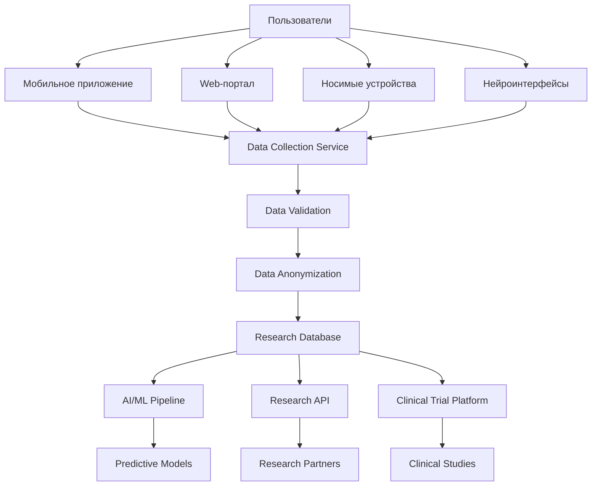

# 🧠 Стратегия сбора данных для нейротехнологических исследований

## Обзор

Стратегия сбора, структурирования и анонимизации медицинских данных для будущих исследований в области нейротехнологий и восстановления после инсульта.

## Цели сбора данных

### 1. Исследовательские цели
- **Понимание паттернов восстановления** после инсульта
- **Выявление факторов успешной реабилитации**
- **Создание предиктивных моделей** для прогнозирования исходов
- **Разработка персонализированных протоколов** лечения

### 2. Технологические цели
- **Обучение AI-моделей** для диагностики и лечения
- **Создание датасетов** для нейротехнологических исследований
- **Валидация новых методов** восстановления нейросвязей
- **Подготовка данных** для клинических испытаний

## Типы собираемых данных

### 1. Клинические данные
```typescript
interface ClinicalData {
  // Базовая информация о пациенте
  demographics: {
    age: number;
    gender: 'male' | 'female' | 'other';
    ethnicity: string;
    location: {
      country: string;
      region: string;
      urban_rural: 'urban' | 'rural';
    };
  };

  // Информация об инсульте
  stroke_info: {
    type: 'ischemic' | 'hemorrhagic' | 'tia';
    severity: 'mild' | 'moderate' | 'severe';
    affected_areas: string[]; // ['left_hemisphere', 'right_hemisphere', 'brainstem']
    onset_date: Date;
    hospital_admission: Date;
    discharge_date: Date;
  };

  // Медицинская история
  medical_history: {
    comorbidities: string[]; // ['hypertension', 'diabetes', 'atrial_fibrillation']
    medications: {
      pre_stroke: string[];
      post_stroke: string[];
      current: string[];
    };
    family_history: {
      stroke: boolean;
      cardiovascular_disease: boolean;
      diabetes: boolean;
    };
  };

  // Реабилитационные данные
  rehabilitation: {
    start_date: Date;
    duration_weeks: number;
    sessions_per_week: number;
    therapy_types: string[]; // ['physical', 'speech', 'occupational', 'cognitive']
    progress_metrics: {
      motor_function: number; // 0-100
      speech_function: number; // 0-100
      cognitive_function: number; // 0-100
      independence_level: number; // 0-100
    };
  };
}
```

### 2. Поведенческие данные
```typescript
interface BehavioralData {
  // Активность в приложении
  app_usage: {
    daily_active_minutes: number;
    features_used: string[];
    engagement_score: number; // 0-100
    social_interactions: number;
  };

  // Дневник здоровья
  health_diary: {
    mood_trends: number[]; // -5 to +5
    symptom_patterns: {
      headaches: number[];
      fatigue: number[];
      memory_issues: number[];
      speech_difficulties: number[];
    };
    medication_adherence: number; // 0-100
    exercise_frequency: number;
  };

  // Социальная активность
  social_engagement: {
    posts_count: number;
    comments_count: number;
    support_group_participation: number;
    mentor_mentee_relationships: number;
  };
}
```

### 3. Биометрические данные
```typescript
interface BiometricData {
  // Данные с носимых устройств
  wearable_data: {
    heart_rate: {
      resting: number;
      variability: number;
      trends: number[];
    };
    blood_pressure: {
      systolic: number[];
      diastolic: number[];
      trends: string; // 'improving', 'stable', 'worsening'
    };
    sleep_patterns: {
      duration: number;
      quality: number; // 0-100
      deep_sleep_percentage: number;
      rem_sleep_percentage: number;
    };
    activity_levels: {
      steps: number[];
      calories_burned: number[];
      active_minutes: number[];
    };
  };

  // Когнитивные тесты
  cognitive_assessments: {
    memory_tests: {
      short_term: number[];
      long_term: number[];
      working_memory: number[];
    };
    attention_tests: {
      sustained_attention: number[];
      selective_attention: number[];
      divided_attention: number[];
    };
    language_tests: {
      comprehension: number[];
      expression: number[];
      fluency: number[];
    };
  };
}
```

### 4. Нейротехнологические данные (будущее)
```typescript
interface NeurotechnologyData {
  // Данные с нейроинтерфейсов
  brain_computer_interface: {
    eeg_signals: {
      alpha_waves: number[];
      beta_waves: number[];
      gamma_waves: number[];
      coherence: number[][];
    };
    neural_activity: {
      firing_rates: number[];
      synchronization: number[];
      plasticity_indicators: number[];
    };
    motor_imagery: {
      accuracy: number;
      response_time: number;
      brain_patterns: number[][];
    };
  };

  // Данные с имплантов (Neuralink, Synchron)
  implant_data: {
    neural_spikes: number[][];
    local_field_potentials: number[][];
    stimulation_responses: {
      motor_cortex: number[];
      sensory_cortex: number[];
      language_areas: number[];
    };
  };
}
```

## Архитектура сбора данных

### 1. Многоуровневая система сбора


### 2. Сервис сбора данных
```typescript
@Injectable()
export class DataCollectionService {
  constructor(
    private readonly dataValidationService: DataValidationService,
    private readonly anonymizationService: AnonymizationService,
    private readonly researchRepository: ResearchRepository,
  ) {}

  async collectHealthData(userId: string, data: HealthData): Promise<void> {
    // 1. Валидация данных
    const validatedData = await this.dataValidationService.validate(data);
    
    // 2. Анонимизация
    const anonymizedData = await this.anonymizationService.anonymize(validatedData, userId);
    
    // 3. Сохранение в исследовательскую базу
    await this.researchRepository.saveHealthData(anonymizedData);
    
    // 4. Обновление индексов для поиска
    await this.updateResearchIndexes(anonymizedData);
  }

  async collectBehavioralData(userId: string, data: BehavioralData): Promise<void> {
    const validatedData = await this.dataValidationService.validate(data);
    const anonymizedData = await this.anonymizationService.anonymize(validatedData, userId);
    
    await this.researchRepository.saveBehavioralData(anonymizedData);
    await this.updateBehavioralIndexes(anonymizedData);
  }

  async collectBiometricData(userId: string, data: BiometricData): Promise<void> {
    const validatedData = await this.dataValidationService.validate(data);
    const anonymizedData = await this.anonymizationService.anonymize(validatedData, userId);
    
    await this.researchRepository.saveBiometricData(anonymizedData);
    await this.updateBiometricIndexes(anonymizedData);
  }
}
```

## Анонимизация данных

### 1. Стратегия анонимизации
```typescript
export class DataAnonymizationService {
  async anonymize(data: any, userId: string): Promise<AnonymizedData> {
    const anonymizedId = this.generateAnonymizedId(userId);
    
    return {
      // Замена идентификаторов
      anonymized_user_id: anonymizedId,
      
      // Обобщение демографических данных
      age_group: this.getAgeGroup(data.demographics.age),
      gender: data.demographics.gender,
      region: this.getRegionGroup(data.demographics.location.region),
      
      // Анонимизация медицинских данных
      stroke_type: data.stroke_info.type,
      stroke_severity: data.stroke_info.severity,
      affected_areas: data.stroke_info.affected_areas,
      
      // Временные данные (смещение на случайное количество дней)
      time_offset: this.generateTimeOffset(),
      
      // Сохранение паттернов без конкретных значений
      patterns: this.extractPatterns(data),
      
      // Удаление всех персональных идентификаторов
      personal_info: null,
    };
  }

  private generateAnonymizedId(userId: string): string {
    return crypto.createHash('sha256')
      .update(userId + process.env.ANONYMIZATION_SALT)
      .digest('hex')
      .substring(0, 16);
  }

  private getAgeGroup(age: number): string {
    if (age < 30) return '18-29';
    if (age < 40) return '30-39';
    if (age < 50) return '40-49';
    if (age < 60) return '50-59';
    if (age < 70) return '60-69';
    return '70+';
  }

  private extractPatterns(data: any): any {
    // Извлечение паттернов без конкретных значений
    return {
      recovery_trajectory: this.analyzeRecoveryPattern(data.rehabilitation),
      behavioral_patterns: this.analyzeBehaviorPattern(data.behavioral),
      biometric_trends: this.analyzeBiometricTrends(data.biometric),
    };
  }
}
```

### 2. Контроль качества анонимизации
```typescript
export class AnonymizationQualityControl {
  async validateAnonymization(originalData: any, anonymizedData: any): Promise<boolean> {
    // Проверка, что все персональные данные удалены
    const hasPersonalInfo = this.checkForPersonalInfo(anonymizedData);
    if (hasPersonalInfo) return false;

    // Проверка, что данные все еще полезны для исследований
    const researchValue = this.assessResearchValue(anonymizedData);
    if (researchValue < 0.7) return false;

    // Проверка на возможность деанонимизации
    const reidentificationRisk = this.assessReidentificationRisk(anonymizedData);
    if (reidentificationRisk > 0.1) return false;

    return true;
  }
}
```

## Структура исследовательской базы данных

### 1. Схема базы данных
```sql
-- Исследовательская база данных
CREATE SCHEMA research_data;

-- Анонимизированные профили пациентов
CREATE TABLE research_data.anonymized_profiles (
    anonymized_id VARCHAR(16) PRIMARY KEY,
    age_group VARCHAR(10) NOT NULL,
    gender VARCHAR(10) NOT NULL,
    region VARCHAR(50) NOT NULL,
    stroke_type VARCHAR(20) NOT NULL,
    stroke_severity VARCHAR(20) NOT NULL,
    affected_areas TEXT[] NOT NULL,
    created_at TIMESTAMP DEFAULT CURRENT_TIMESTAMP
);

-- Клинические данные
CREATE TABLE research_data.clinical_data (
    id UUID PRIMARY KEY DEFAULT gen_random_uuid(),
    anonymized_id VARCHAR(16) REFERENCES research_data.anonymized_profiles(anonymized_id),
    data_type VARCHAR(50) NOT NULL,
    data_json JSONB NOT NULL,
    time_offset INTEGER NOT NULL, -- Смещение времени в днях
    created_at TIMESTAMP DEFAULT CURRENT_TIMESTAMP
);

-- Поведенческие данные
CREATE TABLE research_data.behavioral_data (
    id UUID PRIMARY KEY DEFAULT gen_random_uuid(),
    anonymized_id VARCHAR(16) REFERENCES research_data.anonymized_profiles(anonymized_id),
    app_usage JSONB,
    health_diary JSONB,
    social_engagement JSONB,
    time_offset INTEGER NOT NULL,
    created_at TIMESTAMP DEFAULT CURRENT_TIMESTAMP
);

-- Биометрические данные
CREATE TABLE research_data.biometric_data (
    id UUID PRIMARY KEY DEFAULT gen_random_uuid(),
    anonymized_id VARCHAR(16) REFERENCES research_data.anonymized_profiles(anonymized_id),
    wearable_data JSONB,
    cognitive_assessments JSONB,
    time_offset INTEGER NOT NULL,
    created_at TIMESTAMP DEFAULT CURRENT_TIMESTAMP
);

-- Индексы для быстрого поиска
CREATE INDEX idx_clinical_data_type ON research_data.clinical_data(data_type);
CREATE INDEX idx_clinical_anonymized_id ON research_data.clinical_data(anonymized_id);
CREATE INDEX idx_behavioral_anonymized_id ON research_data.behavioral_data(anonymized_id);
CREATE INDEX idx_biometric_anonymized_id ON research_data.biometric_data(anonymized_id);

-- Индексы для JSON полей
CREATE INDEX idx_clinical_data_json ON research_data.clinical_data USING GIN(data_json);
CREATE INDEX idx_behavioral_data_json ON research_data.behavioral_data USING GIN(app_usage);
```

## API для исследователей

### 1. Research Data API
```typescript
@Controller('research/data')
export class ResearchDataController {
  constructor(private readonly researchService: ResearchService) {}

  @Get('demographics')
  @UseGuards(ResearchAccessGuard)
  async getDemographics(@Query() filters: DemographicsFilters): Promise<DemographicsData> {
    return this.researchService.getDemographics(filters);
  }

  @Get('clinical')
  @UseGuards(ResearchAccessGuard)
  async getClinicalData(@Query() filters: ClinicalFilters): Promise<ClinicalData[]> {
    return this.researchService.getClinicalData(filters);
  }

  @Get('behavioral')
  @UseGuards(ResearchAccessGuard)
  async getBehavioralData(@Query() filters: BehavioralFilters): Promise<BehavioralData[]> {
    return this.researchService.getBehavioralData(filters);
  }

  @Get('biometric')
  @UseGuards(ResearchAccessGuard)
  async getBiometricData(@Query() filters: BiometricFilters): Promise<BiometricData[]> {
    return this.researchService.getBiometricData(filters);
  }

  @Get('patterns')
  @UseGuards(ResearchAccessGuard)
  async getRecoveryPatterns(@Query() filters: PatternFilters): Promise<RecoveryPattern[]> {
    return this.researchService.getRecoveryPatterns(filters);
  }
}
```

### 2. Фильтры для исследователей
```typescript
export class DemographicsFilters {
  @IsOptional()
  @IsArray()
  age_groups?: string[]; // ['18-29', '30-39', ...]

  @IsOptional()
  @IsArray()
  genders?: string[]; // ['male', 'female', 'other']

  @IsOptional()
  @IsArray()
  regions?: string[]; // ['North America', 'Europe', 'Asia']

  @IsOptional()
  @IsArray()
  stroke_types?: string[]; // ['ischemic', 'hemorrhagic', 'tia']

  @IsOptional()
  @IsArray()
  stroke_severities?: string[]; // ['mild', 'moderate', 'severe']

  @IsOptional()
  @IsDateString()
  start_date?: string;

  @IsOptional()
  @IsDateString()
  end_date?: string;
}
```

## Согласие на использование данных

### 1. Система согласий
```typescript
export class ConsentService {
  async requestDataConsent(userId: string, researchPurpose: string): Promise<ConsentRequest> {
    const consentRequest = {
      id: uuidv4(),
      user_id: userId,
      research_purpose: researchPurpose,
      data_types: this.getDataTypesForPurpose(researchPurpose),
      anonymization_level: 'high',
      retention_period: '10 years',
      third_party_sharing: false,
      created_at: new Date(),
      expires_at: new Date(Date.now() + 365 * 24 * 60 * 60 * 1000), // 1 год
    };

    await this.consentRepository.save(consentRequest);
    await this.notificationService.sendConsentRequest(userId, consentRequest);

    return consentRequest;
  }

  async grantConsent(consentId: string, userId: string): Promise<void> {
    const consent = await this.consentRepository.findById(consentId);
    if (!consent || consent.user_id !== userId) {
      throw new ForbiddenException('Consent not found');
    }

    await this.consentRepository.update(consentId, {
      status: 'granted',
      granted_at: new Date(),
    });

    // Активация сбора данных для исследований
    await this.dataCollectionService.enableResearchDataCollection(userId, consent);
  }
}
```

## Метрики и аналитика

### 1. Качество данных
```typescript
export class DataQualityMetrics {
  async calculateCompleteness(): Promise<DataCompletenessMetrics> {
    return {
      clinical_data_completeness: await this.calculateClinicalCompleteness(),
      behavioral_data_completeness: await this.calculateBehavioralCompleteness(),
      biometric_data_completeness: await this.calculateBiometricCompleteness(),
      overall_completeness: await this.calculateOverallCompleteness(),
    };
  }

  async calculateConsistency(): Promise<DataConsistencyMetrics> {
    return {
      temporal_consistency: await this.checkTemporalConsistency(),
      cross_validation_accuracy: await this.validateCrossData(),
      anomaly_detection: await this.detectAnomalies(),
    };
  }
}
```

### 2. Исследовательская аналитика
```typescript
export class ResearchAnalytics {
  async generateInsights(filters: ResearchFilters): Promise<ResearchInsights> {
    return {
      recovery_patterns: await this.analyzeRecoveryPatterns(filters),
      demographic_correlations: await this.findDemographicCorrelations(filters),
      treatment_effectiveness: await this.analyzeTreatmentEffectiveness(filters),
      behavioral_indicators: await this.identifyBehavioralIndicators(filters),
      predictive_factors: await this.findPredictiveFactors(filters),
    };
  }
}
```

## Планы развития

### 1. Краткосрочные цели (1-2 года)
- [ ] Внедрение базового сбора данных
- [ ] Создание системы анонимизации
- [ ] Разработка API для исследователей
- [ ] Партнерство с 3-5 медицинскими центрами

### 2. Среднесрочные цели (3-5 лет)
- [ ] Интеграция с нейротехнологическими устройствами
- [ ] Создание AI-моделей для прогнозирования
- [ ] Партнерство с Neuralink, Synchron, Kernel
- [ ] Запуск клинических испытаний

### 3. Долгосрочные цели (5+ лет)
- [ ] Глобальная база данных инсультников
- [ ] Платформа для нейротехнологических исследований
- [ ] Прямая интеграция с нейроинтерфейсами
- [ ] Революция в восстановлении после инсульта

---
*Последнее обновление: 14.09.2025*
