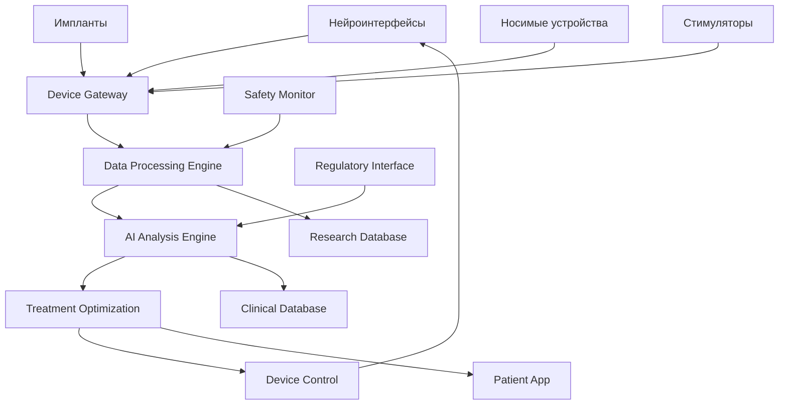

# 🧠 Интеграция с нейротехнологиями

## Обзор

Технические требования и архитектура для интеграции с нейротехнологическими устройствами будущего, включая нейроинтерфейсы, импланты и системы стимуляции мозга.

## Цели интеграции

### 1. Восстановление функций
- **Моторные функции** - восстановление движения конечностей
- **Речевые функции** - восстановление речи и коммуникации
- **Когнитивные функции** - улучшение памяти и внимания
- **Сенсорные функции** - восстановление тактильных ощущений

### 2. Мониторинг состояния
- **Нейронная активность** - отслеживание восстановления связей
- **Пластичность мозга** - мониторинг нейропластичности
- **Эффективность лечения** - оценка результатов терапии
- **Побочные эффекты** - раннее выявление осложнений

### 3. Персонализация терапии
- **Адаптивные протоколы** - индивидуальные схемы лечения
- **Реальное время** - мгновенная корректировка терапии
- **Машинное обучение** - оптимизация на основе данных
- **Предиктивная медицина** - прогнозирование результатов

## Архитектура интеграции

### 1. Системная архитектура


### 2. Микросервисы для нейротехнологий
```typescript
interface NeurotechnologyServices {
  // Управление устройствами
  device_management: {
    device_registry: DeviceRegistryService;
    device_control: DeviceControlService;
    device_monitoring: DeviceMonitoringService;
    device_safety: DeviceSafetyService;
  };

  // Обработка данных
  data_processing: {
    neural_data_processor: NeuralDataProcessorService;
    signal_analysis: SignalAnalysisService;
    data_fusion: DataFusionService;
    real_time_processing: RealTimeProcessingService;
  };

  // AI и машинное обучение
  ai_services: {
    neural_decoder: NeuralDecoderService;
    treatment_optimizer: TreatmentOptimizerService;
    outcome_predictor: OutcomePredictorService;
    adaptive_learning: AdaptiveLearningService;
  };

  // Клиническая интеграция
  clinical_integration: {
    treatment_protocols: TreatmentProtocolService;
    patient_monitoring: PatientMonitoringService;
    safety_alerts: SafetyAlertService;
    clinical_decision_support: ClinicalDecisionSupportService;
  };
}
```

## Интеграция с Neuralink

### 1. API для Neuralink
```typescript
interface NeuralinkIntegration {
  // Получение данных с импланта
  async getNeuralData(participantId: string): Promise<NeuralinkData> {
    const device = await this.getNeuralinkDevice(participantId);
    
    return {
      // Нейронные спайки
      spike_data: {
        timestamps: number[];
        channels: number[];
        amplitudes: number[];
        waveforms: number[][];
      },
      
      // Локальные полевые потенциалы
      lfp_data: {
        timestamps: number[];
        channels: number[];
        frequencies: number[];
        power_spectrum: number[][];
      },
      
      // Стимуляция
      stimulation_data: {
        target_areas: string[];
        intensities: number[];
        frequencies: number[];
        durations: number[];
        responses: number[][];
      },
      
      // Метаданные устройства
      device_status: {
        battery_level: number;
        temperature: number;
        impedance: number[][];
        error_codes: string[];
        firmware_version: string;
      }
    };
  }

  // Управление стимуляцией
  async controlStimulation(participantId: string, parameters: StimulationParameters): Promise<void> {
    const device = await this.getNeuralinkDevice(participantId);
    
    // Валидация параметров безопасности
    const safetyCheck = await this.validateStimulationSafety(parameters);
    if (!safetyCheck.is_safe) {
      throw new Error(`Stimulation safety check failed: ${safetyCheck.reasons.join(', ')}`);
    }

    // Отправка команд на устройство
    await this.sendStimulationCommand(device, parameters);
    
    // Мониторинг ответа
    await this.monitorStimulationResponse(participantId, parameters);
  }

  // Декодирование намерений
  async decodeMotorIntent(participantId: string, neuralData: SpikeData): Promise<MotorIntent> {
    const decoder = await this.getMotorDecoder(participantId);
    
    return {
      left_hand: await decoder.predictLeftHandMovement(neuralData),
      right_hand: await decoder.predictRightHandMovement(neuralData),
      speech: await decoder.predictSpeechIntent(neuralData),
      confidence: await decoder.calculateConfidence(neuralData),
    };
  }
}
```

### 2. Обработка данных Neuralink
```typescript
export class NeuralinkDataProcessor {
  async processSpikeData(rawData: RawSpikeData): Promise<ProcessedSpikeData> {
    // Фильтрация шума
    const filteredData = await this.filterNoise(rawData);
    
    // Выделение спайков
    const spikes = await this.detectSpikes(filteredData);
    
    // Классификация нейронов
    const classifiedSpikes = await this.classifyNeurons(spikes);
    
    // Вычисление метрик
    const metrics = await this.calculateMetrics(classifiedSpikes);
    
    return {
      spikes: classifiedSpikes,
      metrics: metrics,
      quality_score: await this.calculateQualityScore(classifiedSpikes),
    };
  }

  async processLFPData(rawData: RawLFPData): Promise<ProcessedLFPData> {
    // Применение фильтров
    const filteredData = await this.applyBandpassFilters(rawData);
    
    // Спектральный анализ
    const powerSpectrum = await this.calculatePowerSpectrum(filteredData);
    
    // Выделение ритмов
    const rhythms = await this.extractRhythms(powerSpectrum);
    
    // Когерентность между каналами
    const coherence = await this.calculateCoherence(filteredData);
    
    return {
      power_spectrum: powerSpectrum,
      rhythms: rhythms,
      coherence: coherence,
      quality_score: await this.calculateLFPQuality(filteredData),
    };
  }
}
```

## Интеграция с Synchron

### 1. API для Synchron Stentrode
```typescript
interface SynchronIntegration {
  // Получение данных с Stentrode
  async getStentrodeData(participantId: string): Promise<StentrodeData> {
    const device = await this.getStentrodeDevice(participantId);
    
    return {
      // Нейронные сигналы
      neural_signals: {
        timestamps: number[];
        channels: number[];
        amplitudes: number[];
        signal_quality: number[];
      },
      
      // Намерения движения
      motor_intent: {
        left_hand: number;
        right_hand: number;
        speech: number;
        confidence: number;
      },
      
      // Когнитивное состояние
      cognitive_state: {
        attention: number;
        memory: number;
        language: number;
        fatigue: number;
      },
      
      // Статус устройства
      device_status: {
        signal_quality: number;
        battery_level: number;
        connection_status: string;
        error_codes: string[];
      }
    };
  }

  // Управление внешними устройствами
  async controlExternalDevice(participantId: string, deviceType: string, command: DeviceCommand): Promise<void> {
    const stentrodeData = await this.getStentrodeData(participantId);
    const intent = await this.decodeIntent(stentrodeData);
    
    switch (deviceType) {
      case 'cursor':
        await this.controlCursor(intent, command);
        break;
      case 'text_input':
        await this.controlTextInput(intent, command);
        break;
      case 'voice_synthesis':
        await this.controlVoiceSynthesis(intent, command);
        break;
      case 'wheelchair':
        await this.controlWheelchair(intent, command);
        break;
      default:
        throw new Error(`Unsupported device type: ${deviceType}`);
    }
  }
}
```

### 2. Декодирование намерений
```typescript
export class IntentDecoder {
  async decodeMotorIntent(neuralSignals: NeuralSignals): Promise<MotorIntent> {
    // Предобработка сигналов
    const preprocessed = await this.preprocessSignals(neuralSignals);
    
    // Извлечение признаков
    const features = await this.extractFeatures(preprocessed);
    
    // Классификация намерений
    const intent = await this.classifyIntent(features);
    
    return {
      left_hand: intent.left_hand,
      right_hand: intent.right_hand,
      speech: intent.speech,
      confidence: intent.confidence,
    };
  }

  async decodeCognitiveState(neuralSignals: NeuralSignals): Promise<CognitiveState> {
    const features = await this.extractCognitiveFeatures(neuralSignals);
    
    return {
      attention: await this.predictAttention(features),
      memory: await this.predictMemory(features),
      language: await this.predictLanguage(features),
      fatigue: await this.predictFatigue(features),
    };
  }
}
```

## Интеграция с Kernel

### 1. API для Kernel Flow
```typescript
interface KernelIntegration {
  // Получение данных с Kernel Flow
  async getKernelData(participantId: string): Promise<KernelData> {
    const device = await this.getKernelDevice(participantId);
    
    return {
      // Функциональная ближняя инфракрасная спектроскопия (fNIRS)
      fnirs_data: {
        timestamps: number[];
        channels: number[];
        hbo_concentration: number[][]; // Оксигенированный гемоглобин
        hbr_concentration: number[][]; // Дезоксигенированный гемоглобин
        total_hb: number[][]; // Общий гемоглобин
      },
      
      // Метаданные
      metadata: {
        sampling_rate: number;
        channel_locations: number[][];
        device_status: string;
        signal_quality: number[];
      }
    };
  }

  // Анализ мозговой активности
  async analyzeBrainActivity(participantId: string, taskType: string): Promise<BrainActivityAnalysis> {
    const kernelData = await this.getKernelData(participantId);
    
    // Анализ гемодинамических ответов
    const hemodynamicResponse = await this.analyzeHemodynamicResponse(kernelData.fnirs_data);
    
    // Активация областей мозга
    const brainActivation = await this.mapBrainActivation(hemodynamicResponse);
    
    // Сравнение с базовой линией
    const baselineComparison = await this.compareToBaseline(brainActivation, taskType);
    
    return {
      hemodynamic_response: hemodynamicResponse,
      brain_activation: brainActivation,
      baseline_comparison: baselineComparison,
      task_performance: await this.assessTaskPerformance(kernelData, taskType),
    };
  }
}
```

## Система безопасности

### 1. Мониторинг безопасности устройств
```typescript
export class DeviceSafetyMonitor {
  async monitorDeviceSafety(participantId: string, deviceType: string): Promise<SafetyStatus> {
    const device = await this.getDevice(participantId, deviceType);
    const safetyChecks = await this.performSafetyChecks(device);
    
    return {
      device_status: safetyChecks.device_status,
      signal_quality: safetyChecks.signal_quality,
      temperature: safetyChecks.temperature,
      impedance: safetyChecks.impedance,
      battery_level: safetyChecks.battery_level,
      error_codes: safetyChecks.error_codes,
      safety_score: await this.calculateSafetyScore(safetyChecks),
    };
  }

  async detectAnomalies(participantId: string, deviceType: string): Promise<Anomaly[]> {
    const currentData = await this.getCurrentDeviceData(participantId, deviceType);
    const historicalData = await this.getHistoricalData(participantId, deviceType);
    
    const anomalies: Anomaly[] = [];
    
    // Проверка на аномальные значения
    const valueAnomalies = await this.detectValueAnomalies(currentData, historicalData);
    anomalies.push(...valueAnomalies);
    
    // Проверка на аномальные паттерны
    const patternAnomalies = await this.detectPatternAnomalies(currentData, historicalData);
    anomalies.push(...patternAnomalies);
    
    // Проверка на безопасность
    const safetyAnomalies = await this.detectSafetyAnomalies(currentData);
    anomalies.push(...safetyAnomalies);
    
    return anomalies;
  }

  async handleSafetyAlert(participantId: string, alert: SafetyAlert): Promise<void> {
    // Немедленное уведомление команды
    await this.notifySafetyTeam(participantId, alert);
    
    // Остановка устройства при критических нарушениях
    if (alert.severity === 'Critical') {
      await this.emergencyStopDevice(participantId, alert.device_type);
    }
    
    // Логирование для аудита
    await this.logSafetyEvent(participantId, alert);
    
    // Уведомление пациента
    await this.notifyPatient(participantId, alert);
  }
}
```

### 2. Протоколы безопасности
```typescript
export class SafetyProtocols {
  // Протокол для Neuralink
  async validateNeuralinkStimulation(parameters: NeuralinkStimulationParameters): Promise<ValidationResult> {
    const checks = [
      this.checkIntensityLimits(parameters.intensity),
      this.checkFrequencyLimits(parameters.frequency),
      this.checkDurationLimits(parameters.duration),
      this.checkTargetAreaSafety(parameters.target_area),
      this.checkImpedanceSafety(parameters.impedance),
    ];

    const results = await Promise.all(checks);
    const failedChecks = results.filter(r => !r.passed);

    return {
      is_safe: failedChecks.length === 0,
      failed_checks: failedChecks,
      recommendations: await this.generateSafetyRecommendations(failedChecks),
    };
  }

  // Протокол для Synchron
  async validateSynchronControl(command: SynchronControlCommand): Promise<ValidationResult> {
    const checks = [
      this.checkCommandValidity(command),
      this.checkDeviceStatus(command.device_id),
      this.checkUserCapability(command.user_id, command.action),
      this.checkEnvironmentalSafety(command.environment),
    ];

    const results = await Promise.all(checks);
    const failedChecks = results.filter(r => !r.passed);

    return {
      is_safe: failedChecks.length === 0,
      failed_checks: failedChecks,
      recommendations: await this.generateControlRecommendations(failedChecks),
    };
  }
}
```

## AI и машинное обучение

### 1. Нейронные декодеры
```typescript
export class NeuralDecoder {
  async trainMotorDecoder(participantId: string, trainingData: TrainingData): Promise<MotorDecoder> {
    const decoder = new MotorDecoder();
    
    // Подготовка данных
    const preprocessedData = await this.preprocessTrainingData(trainingData);
    
    // Обучение модели
    await decoder.train(preprocessedData, {
      algorithm: 'LSTM',
      hidden_layers: 128,
      learning_rate: 0.001,
      epochs: 1000,
      validation_split: 0.2,
    });
    
    // Валидация модели
    const validation = await decoder.validate(preprocessedData);
    if (validation.accuracy < 0.8) {
      throw new Error('Decoder accuracy too low for clinical use');
    }
    
    // Сохранение модели
    await this.saveDecoder(participantId, decoder);
    
    return decoder;
  }

  async predictMotorIntent(participantId: string, neuralData: NeuralData): Promise<MotorIntent> {
    const decoder = await this.loadDecoder(participantId);
    return await decoder.predict(neuralData);
  }
}
```

### 2. Оптимизация лечения
```typescript
export class TreatmentOptimizer {
  async optimizeStimulationParameters(participantId: string, currentParameters: StimulationParameters): Promise<OptimizedParameters> {
    const patientProfile = await this.getPatientProfile(participantId);
    const treatmentHistory = await this.getTreatmentHistory(participantId);
    const currentResponse = await this.assessCurrentResponse(participantId);
    
    // Использование reinforcement learning для оптимизации
    const optimizer = new ReinforcementLearningOptimizer();
    
    const optimizedParameters = await optimizer.optimize({
      current_parameters: currentParameters,
      patient_profile: patientProfile,
      treatment_history: treatmentHistory,
      current_response: currentResponse,
      optimization_goal: 'maximize_recovery',
    });
    
    return optimizedParameters;
  }

  async predictTreatmentOutcome(participantId: string, proposedParameters: StimulationParameters): Promise<OutcomePrediction> {
    const patientProfile = await this.getPatientProfile(participantId);
    const similarPatients = await this.findSimilarPatients(patientProfile);
    
    const predictor = new OutcomePredictor();
    const prediction = await predictor.predict({
      patient_profile: patientProfile,
      proposed_parameters: proposedParameters,
      similar_patients: similarPatients,
    });
    
    return {
      expected_improvement: prediction.improvement,
      confidence: prediction.confidence,
      time_to_effect: prediction.time_to_effect,
      potential_side_effects: prediction.side_effects,
    };
  }
}
```

## Клиническая интеграция

### 1. Протоколы лечения
```typescript
export class TreatmentProtocolService {
  async createPersonalizedProtocol(participantId: string, deviceType: string): Promise<TreatmentProtocol> {
    const patientProfile = await this.getPatientProfile(participantId);
    const deviceCapabilities = await this.getDeviceCapabilities(deviceType);
    const clinicalGuidelines = await this.getClinicalGuidelines(patientProfile.condition);
    
    const protocol = await this.generateProtocol({
      patient_profile: patientProfile,
      device_capabilities: deviceCapabilities,
      clinical_guidelines: clinicalGuidelines,
    });
    
    return protocol;
  }

  async adaptProtocol(participantId: string, protocolId: string, responseData: ResponseData): Promise<TreatmentProtocol> {
    const currentProtocol = await this.getProtocol(protocolId);
    const adaptation = await this.calculateAdaptation(currentProtocol, responseData);
    
    const adaptedProtocol = await this.applyAdaptation(currentProtocol, adaptation);
    
    return adaptedProtocol;
  }
}
```

### 2. Мониторинг пациентов
```typescript
export class PatientMonitoringService {
  async monitorTreatmentProgress(participantId: string): Promise<TreatmentProgress> {
    const deviceData = await this.collectDeviceData(participantId);
    const clinicalAssessments = await this.collectClinicalAssessments(participantId);
    const patientReports = await this.collectPatientReports(participantId);
    
    const progress = await this.analyzeProgress({
      device_data: deviceData,
      clinical_assessments: clinicalAssessments,
      patient_reports: patientReports,
    });
    
    return {
      motor_function: progress.motor_function,
      cognitive_function: progress.cognitive_function,
      speech_function: progress.speech_function,
      overall_improvement: progress.overall_improvement,
      treatment_adherence: progress.treatment_adherence,
    };
  }

  async generateProgressReport(participantId: string, period: DateRange): Promise<ProgressReport> {
    const progress = await this.monitorTreatmentProgress(participantId);
    const trends = await this.analyzeTrends(participantId, period);
    const recommendations = await this.generateRecommendations(progress, trends);
    
    return {
      progress_summary: progress,
      trends: trends,
      recommendations: recommendations,
      next_appointment: await this.scheduleNextAppointment(participantId),
    };
  }
}
```

## Планы развития

### 1. Краткосрочные цели (6-12 месяцев)
- [ ] **Базовая интеграция** с существующими нейротехнологиями
- [ ] **API для Neuralink** и Synchron
- [ ] **Система безопасности** для нейроустройств
- [ ] **Пилотные исследования** с 10-20 пациентами

### 2. Среднесрочные цели (1-3 года)
- [ ] **Полная интеграция** с Neuralink, Synchron, Kernel
- [ ] **AI-оптимизация** протоколов лечения
- [ ] **Клинические испытания** с 100+ пациентами
- [ ] **Регуляторные одобрения** для коммерческого использования

### 3. Долгосрочные цели (3+ лет)
- [ ] **Глобальная платформа** для нейрореабилитации
- [ ] **Прямая интеграция** с нейроинтерфейсами
- [ ] **Революция в лечении** инсульта
- [ ] **Новые стандарты** нейрореабилитации

---
*Последнее обновление: 14.09.2025*
